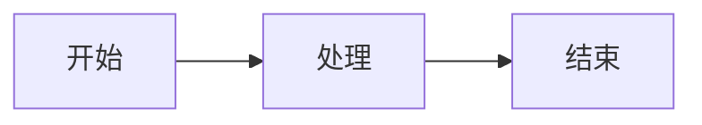

# 📝 内容标准规范

> 知识库文章和面试题的内容格式标准，支持多样化展示形式

---

## 📚 知识库文章标准格式

### 基础元数据（必需）

```markdown
# 文章标题

> **分类**: 领域分类 | **编号**: XXX | **更新时间**: YYYY-MM-DD | **难度**: ⭐/⭐⭐/⭐⭐⭐
```

### 核心结构（必需）

1. **一、核心概念** - 基础定义和背景
2. **二、核心原理** - 技术细节和工作原理
3. **三、应用场景** - 实际使用场景
4. **四、实践建议** - 最佳实践和常见问题
5. **五、总结** - 核心要点和延伸学习

### 多样化展示元素（推荐）

#### 📊 表格

```markdown
| 特性 | 描述 | 优势 | 适用场景 |
|------|------|------|----------|
| 特性 1 | 详细描述 | 优势说明 | 场景说明 |
```

#### 💻 代码块

````markdown
```python
# 带语法高亮的代码示例
def example():
    pass
```
````

支持语言：`python`, `javascript`, `typescript`, `java`, `cpp`, `go`, `rust`, `sql`, `bash`, `json`, `yaml`

#### 📈 流程图（Mermaid）

```markdown

```

支持类型：
- `graph` - 流程图
- `sequenceDiagram` - 时序图
- `classDiagram` - 类图
- `stateDiagram` - 状态图
- `pie` - 饼图
- `gantt` - 甘特图

#### 🖼️ 图片

```markdown


或者本地图片：

```

#### 📹 视频

```markdown
<video controls width="100%">
  <source src="视频 URL" type="video/mp4">
  您的浏览器不支持视频播放
</video>

或者嵌入 B 站/YouTube：
<!-- B 站嵌入 -->
<iframe src="//player.bilibili.com/player.html?bvid=XXX" scrolling="no" border="0" frameborder="no" width="100%" height="500"></iframe>
```

#### 📝 引用块

```markdown
> 💡 **提示**: 重要的提示信息
> 
> ⚠️ **注意**: 需要注意的事项
> 
> 📌 **重点**: 核心知识点
```

#### 🎯 列表

```markdown
## 无序列表
- 项目 1
  - 子项目 1.1
  - 子项目 1.2
- 项目 2

## 有序列表
1. 第一步
2. 第二步
3. 第三步

## 任务列表
- [x] 已完成任务
- [ ] 待完成任务
- [ ] 待完成任务
```

#### 📐 数学公式

```markdown
行内公式：$E = mc^2$

块级公式：
$$
\text{Attention}(Q, K, V) = \text{softmax}(\frac{QK^T}{\sqrt{d_k}})V
$$
```

#### 🏷️ 标签

```markdown
`标签 1` `标签 2` `标签 3`
```

#### 📊 对比表

```markdown
## 对比分析

| 维度 | 方案 A | 方案 B | 方案 C |
|------|--------|--------|--------|
| 性能 | ⭐⭐⭐ | ⭐⭐ | ⭐⭐⭐⭐ |
| 易用性 | ⭐⭐ | ⭐⭐⭐⭐ | ⭐⭐⭐ |
| 扩展性 | ⭐⭐⭐ | ⭐⭐ | ⭐⭐⭐⭐ |
```

---

## 💼 面试题标准格式

### 基础元数据（必需）

```markdown
# 主题 - 面试题

> **分类**: 领域分类 | **编号**: XXX | **题目数量**: X | **难度**: ⭐/⭐⭐/⭐⭐⭐ | **更新时间**: YYYY-MM-DD
```

### 单题结构（必需）

每道题目必须包含：

1. **问题** - 清晰的面试问题
2. **参考答案** - 结构化答案
3. **核心要点** - 关键得分点（至少 3 个）
4. **延伸追问** - 深入问题（至少 3 个）

### 多样化展示元素（推荐）

#### ✅ 评分标准

```markdown
**评分维度**：
- 理解深度（30%）：对核心概念的理解
- 表达能力（25%）：逻辑清晰、表达准确
- 实践经验（25%）：有实际项目经验
- 延伸思考（20%）：能够深入分析和总结
```

#### 📊 难度分级

```markdown
**难度**: ⭐⭐⭐

- ⭐ 基础题：概念记忆和理解
- ⭐⭐ 进阶题：原理分析和应用
- ⭐⭐⭐ 高级题：综合分析和创新
- ⭐⭐⭐⭐ 专家题：前沿研究和批判
```

#### 💡 答题技巧

```markdown
**答题技巧**：
1. 先给出核心定义（10 秒）
2. 展开说明关键原理（30 秒）
3. 举例说明应用场景（30 秒）
4. 总结优缺点和适用条件（20 秒）
```

#### 🔗 关联知识

```markdown
**前置知识**：
- [知识点 A](链接)
- [知识点 B](链接)

**后续知识**：
- [进阶主题 C](链接)
- [相关技术 D](链接)
```

#### 📈 能力雷达图

```markdown
```mermaid
radarChart
    title 能力维度
    "理论基础": 85
    "实践能力": 70
    "创新思维": 60
    "沟通表达": 75
    "问题解决": 80
```
```

#### 🎬 示例对话

```markdown
**面试官**: 请解释一下 XXX 的原理

**候选人**: 好的，XXX 是一种...（优秀回答示例）

**面试官**: 那它和 YYY 有什么区别？

**候选人**: 主要区别在于...（深入分析示例）
```

#### 📚 参考资料

```markdown
**推荐阅读**：
1. 📖 论文：《Attention Is All You Need》
2. 📖 书籍：《深度学习》第 10 章
3. 🔗 博客：https://example.com/article
4. 📹 视频：https://youtube.com/watch?v=XXX
5. 💻 代码：https://github.com/xxx/xxx
```

---

## 🎨 内容质量要求

### 文章质量标准

- ✅ **准确性**: 技术细节准确无误
- ✅ **完整性**: 覆盖核心知识点
- ✅ **实用性**: 包含实际应用案例
- ✅ **可读性**: 结构清晰、表达流畅
- ✅ **时效性**: 跟进最新技术发展

### 试题质量标准

- ✅ **针对性**: 针对核心能力考察
- ✅ **层次性**: 难度分级明确
- ✅ **开放性**: 鼓励深入思考
- ✅ **实用性**: 贴近实际工作
- ✅ **标准化**: 评分标准清晰

### 最低内容要求

**知识库文章**：
- 最少 500 字
- 至少 1 个代码示例
- 至少 1 个图表/流程图
- 至少 2 个应用场景
- 至少 3 个实践建议

**面试题**：
- 至少 5 道题目
- 每道题至少 3 个核心要点
- 每道题至少 3 个延伸追问
- 至少 1 个代码示例
- 至少 1 个实际案例

---

## 📋 检查清单

### 发布前检查

- [ ] 元数据完整（分类、编号、更新时间、难度）
- [ ] 结构完整（所有章节齐全）
- [ ] 代码示例可运行
- [ ] 图表渲染正常
- [ ] 链接有效
- [ ] 无错别字和语法错误
- [ ] 难度标记准确
- [ ] 参考资料有效

### 内容更新

- [ ] 技术更新及时跟进
- [ ] 案例保持新鲜度
- [ ] 代码示例版本更新
- [ ] 参考资料补充最新资源

---

**最后更新**: 2026-03-30
**维护人**: AI 学习与面试大全团队
